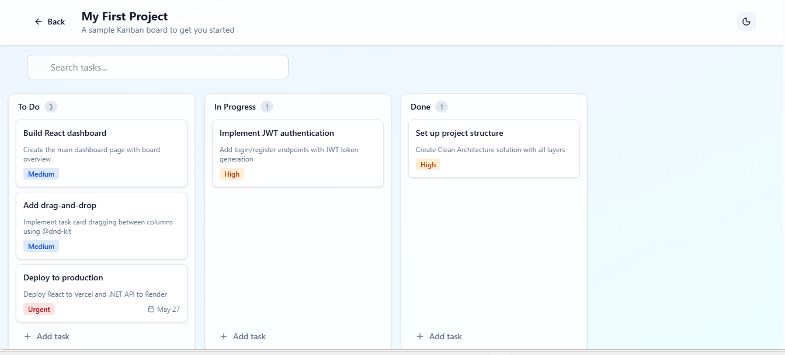
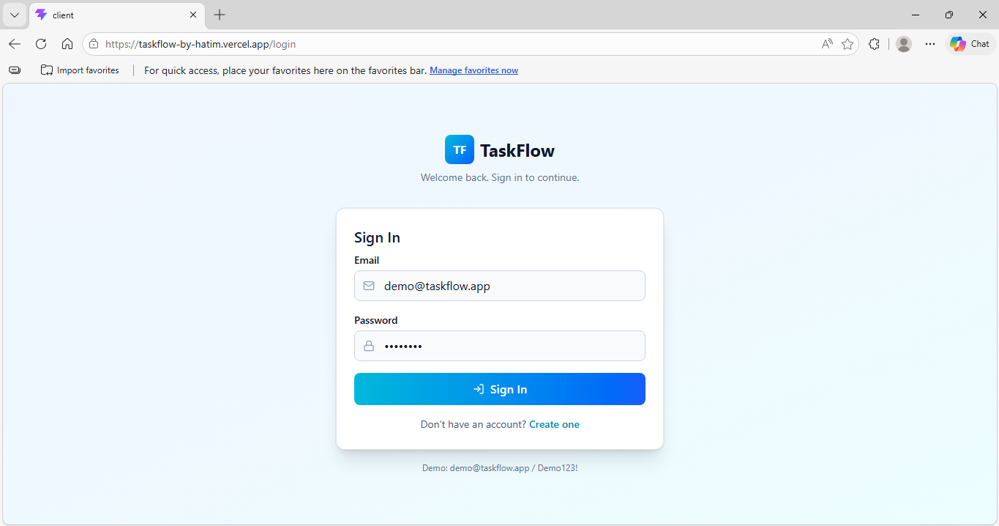
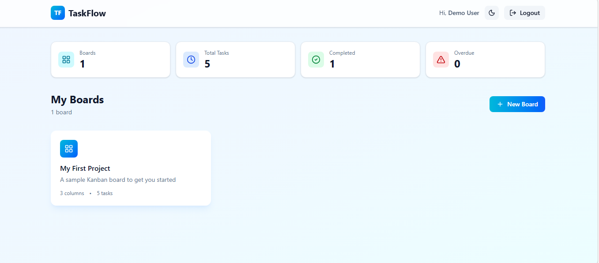
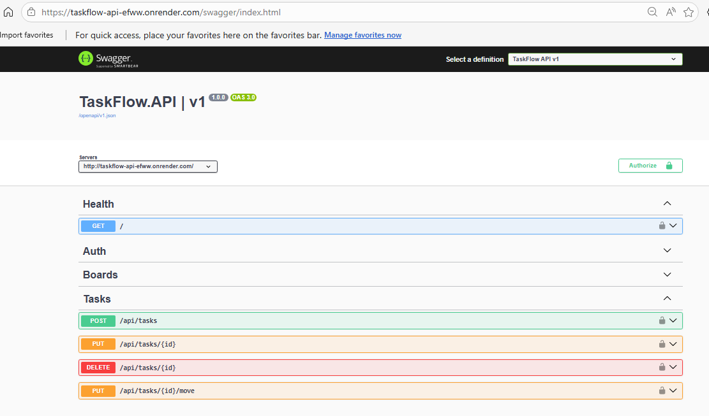

<div align="center">

# TaskFlow

### A full-stack Kanban task-management application — production-ready.

[](https://github.com/HatimBanswadawala/TaskFlow/actions/workflows/ci.yml)
[](https://dotnet.microsoft.com/)
[](https://react.dev/)
[](https://www.docker.com/)
[](LICENSE)

**🌐 Live Demo →** [taskflow-by-hatim.vercel.app](https://taskflow-by-hatim.vercel.app)
**🔌 API →** [taskflow-api-efww.onrender.com](https://taskflow-api-efww.onrender.com)
**📚 Swagger →** [taskflow-api-efww.onrender.com/swagger](https://taskflow-api-efww.onrender.com/swagger)

</div>

---

## 🎯 Try It in 30 Seconds

Demo credentials are pre-seeded — login and explore:

```
📧 Email:    demo@taskflow.app
🔑 Password: Demo123!
```

> ⏱️ **Note:** Render's free tier sleeps after 15 minutes of inactivity. The first request may take ~30 seconds to wake the API. Subsequent requests are instant.

---



---

## ✨ What Makes This Project Special

- 🏗️ **Clean Architecture** with 4 .NET projects — Domain, Application, Infrastructure, API
- 🎯 **CQRS pattern** via MediatR with FluentValidation pipeline behaviors
- 🔐 **JWT authentication** with BCrypt password hashing + automatic email-enumeration prevention
- 🎨 **Drag-and-drop** task movement across columns using `@dnd-kit`
- 🔄 **Polling-based live updates** — multi-user awareness without WebSocket complexity
- 🧪 **13 unit tests** with xUnit + Moq + FluentAssertions, including security-critical paths
- 📊 **Structured logging** with Serilog (Console + rolling File sinks, request logging, custom enrichers)
- 🐳 **Multi-stage Dockerfile** — ~75% smaller production image
- 🚀 **CI/CD pipeline** via GitHub Actions — auto build, test, and Docker validation on every push
- 🌍 **Production deployment** to Render (API) + Vercel (Frontend)

---

## 🛠️ Tech Stack

<table>
<tr>
<th>Backend</th>
<th>Frontend</th>
<th>DevOps & Infrastructure</th>
</tr>
<tr>
<td>

- .NET 9 / C# 12
- ASP.NET Core (Minimal APIs)
- EF Core 9 (InMemory)
- MediatR (CQRS)
- FluentValidation
- JWT Bearer Auth
- BCrypt.Net
- Serilog (structured logging)
- xUnit + Moq + FluentAssertions

</td>
<td>

- React 18 + JavaScript (ES6+)
- Vite 5
- React Router v6
- TanStack Query
- React Hook Form + Zod
- Axios (with JWT interceptors)
- @dnd-kit (drag-and-drop)
- Tailwind CSS v4 (dark mode)

</td>
<td>

- Docker (multi-stage build)
- GitHub Actions (CI/CD)
- Render (API hosting)
- Vercel (frontend hosting)
- OpenAPI / Swagger

</td>
</tr>
</table>

---

## 🏛️ Architecture — Clean Architecture (4 layers)

```
┌──────────────────────────────────────────────────────────┐
│                      TaskFlow.API                         │  ← HTTP layer
│         (Minimal APIs, Auth, CORS, Serilog, Swagger)      │
│                            ↓                               │
│  ┌────────────────────────────────────────────────────┐   │
│  │              TaskFlow.Application                   │  ← Use cases
│  │     (MediatR Handlers, DTOs, Validators, Mappers)   │
│  │                          ↓                          │   │
│  │  ┌──────────────────────────────────────────────┐  │   │
│  │  │              TaskFlow.Domain                  │  ← Pure domain
│  │  │    (Entities, Enums, Interfaces — no deps)    │  │   │
│  │  └──────────────────────────────────────────────┘  │   │
│  └────────────────────────────────────────────────────┘   │
│                                                            │
│                  TaskFlow.Infrastructure                  │  ← External
│   (EF Core DbContext, Repositories, JWT, BCrypt Services)  │
└──────────────────────────────────────────────────────────┘
                            ↑
                    TaskFlow.Tests
              (xUnit + Moq + FluentAssertions)
```

**Dependency rule:** Inner layers know nothing about outer layers. Domain has zero NuGet dependencies — pure C# classes.

---

## 🚀 Quick Start (Run Locally)

### Prerequisites
- .NET 9 SDK
- Node.js 20+
- Git

### 1. Clone the repo
```bash
git clone https://github.com/HatimBanswadawala/TaskFlow.git
cd TaskFlow
```

### 2. Run the API (Terminal 1)
```bash
cd TaskFlow.API
dotnet run
# API runs on http://localhost:5170
# Swagger UI: http://localhost:5170/swagger
```

### 3. Run the React client (Terminal 2)
```bash
cd client
npm install
npm run dev
# Open http://localhost:5173
```

### 4. Login with demo credentials
```
demo@taskflow.app / Demo123!
```

---

## 🧪 Run the Tests

```bash
dotnet test TaskFlow.Tests/TaskFlow.Tests.csproj
```

Expected output:
```
Test Run Successful.
Total tests: 13
     Passed: 13
```

### Test coverage highlights
- ✅ `CreateBoardCommandHandler` — verifies 3 default columns (To Do / In Progress / Done)
- ✅ `CreateBoardCommandValidator` — empty/null/max-length cases
- ✅ `RegisterCommandHandler` — password hashing security, duplicate email rejection
- ✅ `LoginCommandHandler` — auth happy path + email enumeration prevention (same generic error for "wrong password" and "user not found")
- ✅ `MoveTaskCommandHandler` — drag-drop persistence + auto-status mapping + graceful failure paths

---

## 🐳 Docker

The API ships as a multi-stage Docker image:

```bash
# Build (run from repo root)
docker build -t taskflow-api -f TaskFlow.API/Dockerfile .

# Run
docker run -d -p 8080:8080 \
  -e Jwt__Key="your-32+-char-secret-here" \
  -e ASPNETCORE_ENVIRONMENT=Production \
  taskflow-api

# Test
curl http://localhost:8080/
# → {"status":"healthy","app":"TaskFlow API","version":"1.0"}
```

**Multi-stage build benefits:**
- Stage 1: .NET 9 SDK image (~1 GB) — compiles the code
- Stage 2: ASP.NET runtime image (~200 MB) — runs the app
- ~75% smaller final image vs single-stage

---

## ⚙️ CI/CD Pipeline

[](https://github.com/HatimBanswadawala/TaskFlow/actions/workflows/ci.yml)

Every push to `main` triggers `.github/workflows/ci.yml`:

```
Push to main
     ↓
[Job 1: build-and-test]
  • Checkout
  • Setup .NET 9
  • Cache NuGet (keyed on csproj hash)
  • Restore → Build → Test (13 tests)
     ↓ (only if tests pass)
[Job 2: docker-build]
  • Validate Dockerfile builds
  • Layer caching via GitHub Actions cache
```

**Production deployments** auto-trigger when `main` updates:
- **Render** rebuilds the API container from the new commit
- **Vercel** rebuilds the React frontend

---

## 📁 Project Structure

```
TaskFlow/
├── .github/workflows/ci.yml         # GitHub Actions pipeline
├── TaskFlow.Domain/                 # Entities, Enums, Interfaces (no deps)
├── TaskFlow.Application/            # CQRS Handlers, DTOs, Validators, Mappers
├── TaskFlow.Infrastructure/         # EF Core, JWT, BCrypt
├── TaskFlow.API/                    # Minimal APIs, Program.cs, Dockerfile
├── TaskFlow.Tests/                  # 13 unit tests (xUnit + Moq + FluentAssertions)
├── client/                          # React 18 + Vite + Tailwind
│   ├── src/
│   │   ├── pages/                   # Login, Register, Dashboard, BoardDetail
│   │   ├── components/              # Reusable UI
│   │   ├── services/                # apiClient (Axios + JWT interceptors)
│   │   └── contexts/                # AuthContext
│   └── vite.config.js
├── docs/screenshots/                # README images
├── MANUAL.md                        # Full project journal — every decision documented
└── README.md                        # You're reading it
```

---

## 📔 Project Journal

For a deep dive into every decision, tradeoff, and "why we did it this way" — see **[MANUAL.md](MANUAL.md)**. It documents 15+ build sessions across:
- Clean Architecture setup
- MediatR + CQRS patterns
- JWT authentication implementation
- React Router + protected routes
- TanStack Query + drag-and-drop
- Polling-based live updates
- Unit testing patterns
- Serilog configuration
- Docker multi-stage builds
- CI/CD pipeline design
- Production deployment

---

## 📸 More Screenshots

<table>
<tr>
<td></td>
<td></td>
</tr>
<tr>
<td align="center"><b>Login Page</b></td>
<td align="center"><b>Boards Dashboard</b></td>
</tr>
<tr>
<td colspan="2"></td>
</tr>
<tr>
<td colspan="2" align="center"><b>OpenAPI / Swagger UI — interactive API documentation</b></td>
</tr>
</table>

---

## 👤 Author

**Hatim Banswadawala** — Full Stack Developer (.NET + React)

- 💼 LinkedIn: [linkedin.com/in/hatimhussain5253](https://linkedin.com/in/hatimhussain5253)
- 💻 GitHub: [github.com/HatimBanswadawala](https://github.com/HatimBanswadawala)
- 📧 Email: hatimhussainbans5253@gmail.com

---

## 📜 License

[MIT License](LICENSE) — feel free to fork, adapt, and learn from this project.

---

<div align="center">

**⭐ If this project helped you learn something, give it a star!**

Built with .NET 9 · React 18 · ❤️ and a lot of `dotnet test`

</div>
